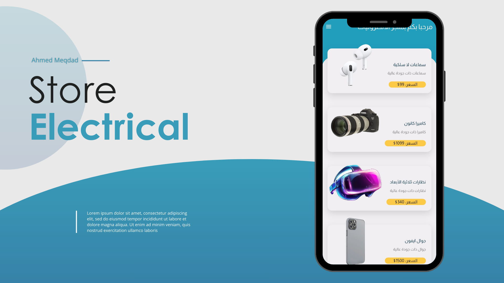

# ⚡ Electrical Store

> 🛍️ A sleek and modern **Flutter e-commerce UI** demo for electronics — fully RTL (Arabic) and easy to extend.  
> Built with simplicity, clean architecture, and beautiful Arabic typography. 🇸🇦

---

## 📘 Table of Contents

- [Project Overview](#-project-overview)
- [Tech Stack](#-tech-stack)
- [Architecture](#-architecture)
- [Features](#-features)
- [How to Run the Project](#-how-to-run-the-project)
- [Screenshots](#-screenshots)
- [Social Links](#-social-links)

---

## 🧩 Project Overview

**Electrical Store** is a clean and simple Flutter application demonstrating a responsive product listing and details screen for an electronic store.  
It’s fully **RTL** and designed to showcase how Arabic-friendly layouts and typography can blend with modern Flutter design.

**🎯 Goals**
- Present a functional, responsive UI demo for e-commerce.
- Provide RTL localization by default.
- Serve as a great starting point for building full e-commerce apps.

---

## 🛠️ Tech Stack

- **Framework:** Flutter 🐦  
- **Language:** Dart 💙  
- **Version:** Dart SDK `^3.8.1`
- **Packages:**
  - `flutter_localizations` — for RTL + Arabic locale
  - `google_fonts` — for `Almarai` Arabic typography
  - `cupertino_icons` — iOS-style icons
  - `flutter_lints` — linting and code quality
- **Platforms Supported:** Android • iOS • Web • macOS  
- **Testing:** `flutter_test` (unit & widget testing)

---

## 🧱 Architecture

The project follows a **modular Flutter architecture** separating UI, models, and helpers for scalability and readability.

---

## ✨ Features

✅ RTL (Arabic) layout enabled by default  
✅ Product listing with images, price & name  
✅ Product details screen with description & colors  
✅ Reusable `ProductCard` and `HomeBody` widgets  
✅ Custom typography via Google Fonts (`Almarai`)  
✅ Organized file structure for scalability  
✅ Multi-platform support (Android, iOS, Web, macOS)

---

## 🚀 How to Run the Project

1. **Clone the repository**  
- git clone https://github.com/a7med2002/electrical_store.git

2. **Install dependencies** 
- flutter pub get

3. **Run the app**
- flutter run

---

## 🖼️ Screenshots

---

## 📦 Download APK  

You can download the latest version of the **Electrical Store App** APK directly from Google Drive:  

👉 [**Download Electrical Store App (APK)**](https://drive.google.com/file/d/1b9OLe4vYiuieKGEktaOh6f1Zcvx9keLN/view?usp=sharing)  

---

## 🌐 Social Links
- 👨‍💻 Developer: [ِAhmed Meqdad]
- 📧 Email: [ahmd2002mqdad@gamil.com]
- 💼 LinkedIn: [linkedin.com/in/ahmed-meqdad](https://www.linkedin.com/in/ahmed-meqdad)